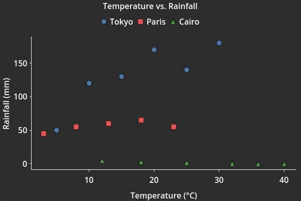
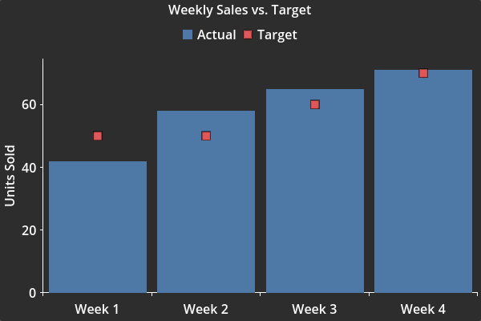
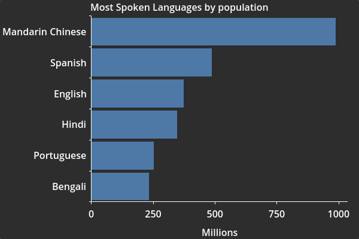
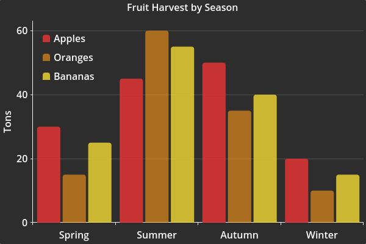
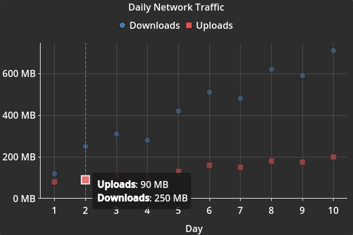
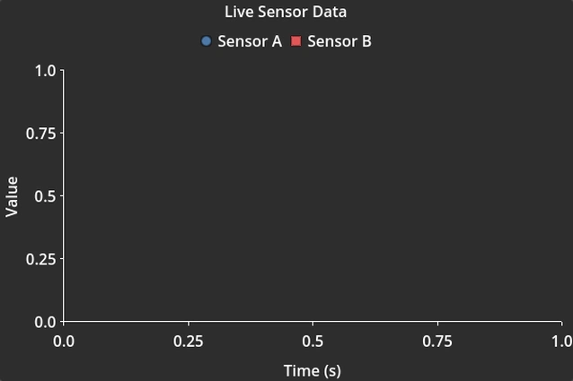
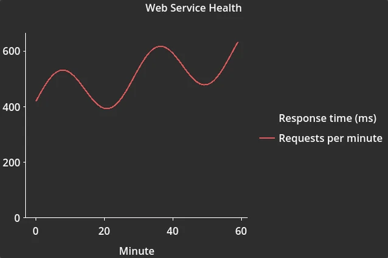

# Getting Started

This guide teaches you how to build XY plots with TauPlot, one step at a time. Each section introduces a new concept and builds on the previous one. By the end you will know how to create bar, line, area, and scatter plots, combine them, use multiple panes, customize the look, add interactivity, stream live data, and animate a plot at runtime.

!!! tip "Prerequisites"
    TauPlot requires **Godot 4.5** or later. Make sure the plugin is enabled in **Project > Project Settings > Plugins**. See the [installation instructions](index.md#installation) if needed.

!!! tip "Scene setup"
    Every example uses the same scene layout: a `CenterContainer` root with a [`TauPlot`](api/tau_plot.md) child node named `MyPlot`. The script is attached to the root node. Give `MyPlot` a `custom_minimum_size` of at least `600 x 400` so the plot has room to render.

## 1. Core concepts

An **XY plot** displays data on two axes: one **X axis** and one **Y axis**. By default the X axis runs along the bottom edge of the plot and the Y axis runs along a side edge, which is the most common layout. But the X axis can be placed on any edge. When you move it to the left or right edge, the whole plot flips and bars grow horizontally instead of vertically. You will see an example of this later in the guide.

TauPlot lets you build XY plots from a few simple building blocks.

A **series** is a named sequence of (X, Y) data points. For example, the monthly temperatures of a city form one series. A plot can display one series or many at once.

A **dataset** is the container that holds all your series. You create it, fill it with values, and hand it to the plot. There are two flavors: in a [`SHARED_X`](api/dataset.md#mode) dataset every series uses the same X values, and in a [`PER_SERIES_X`](api/dataset.md#mode) dataset each series has its own X values. You describe a dataset with a [`Dataset`](api/dataset.md) object.

A **pane** is a rectangular drawing area inside the plot. It has its own Y axis (or two) and its own visual layers. Most plots need only one pane, but you can stack several when your series have very different scales. You describe a pane with a [`TauPaneConfig`](api/pane_config.md).

An **overlay** is a visual layer inside a pane that actually draws the data points. A bar overlay draws bars. A scatter overlay draws markers. A line overlay draws curves, and can paint the area between these curves and a baseline, which is how you get an area chart. A single pane can contain all three at once. You describe a bar overlay with a [`TauBarConfig`](api/bar_config.md), a scatter overlay with a [`TauScatterConfig`](api/scatter_config.md), and a line overlay with a [`TauLineConfig`](api/line_config.md).

An **axis** defines how values map to positions on the screen. A categorical axis shows labels like "Jan", "Feb", "Mar". A continuous axis shows a numeric range. You describe an axis with a [`TauAxisConfig`](api/axis_config.md).

A **binding** connects one series from the dataset to a specific pane, overlay type, and Y axis. It answers the question: "where and how should this series appear?" You describe each binding with a [`TauXYSeriesBinding`](api/xy_series_binding.md). Most of the time you create one binding per series, but a series can also appear in several bindings if you want to render it in multiple panes or through multiple overlay types.

Finally, the [**TauPlot node**](api/tau_plot.md) is the Godot `Control` you add to your scene. Once you have the dataset, the configuration, and the bindings ready, you call [`plot_xy()`](api/tau_plot.md#plot_xy) and TauPlot draws everything.

The workflow is always the same:

1. Create a [`Dataset`](api/dataset.md) with your data.
2. Describe the plot structure with a [`TauXYConfig`](api/xy_config.md) (axes, panes, overlays).
3. Create [`TauXYSeriesBinding`](api/xy_series_binding.md) objects to connect series to visuals.
4. Call [`plot_xy()`](api/tau_plot.md#plot_xy).

## 2. A simple scatter plot

The [quick start](index.md#quick-start) on the home page shows a categorical bar plot. Here you will create a scatter plot with numeric data on both axes.

A complete, runnable version of this example is available [here](https://github.com/ze2j/tau-plot/tree/main/addons/tau-plot/examples/getting_started/getting_started_2.gd).

```gdscript
extends CenterContainer

func _ready() -> void:
	# Create a dataset with three cities. Each city has its own temperature
	# and rainfall readings, so we use PER_SERIES_X: each series brings
	# its own X values. Notice that Paris only has 5 readings while the
	# others have 6. That is fine with PER_SERIES_X.
	var dataset := TauPlot.Dataset.make_per_series_x_continuous(
		# Series names
		PackedStringArray(
		[
			"Tokyo",
			"Paris",
			"Cairo"
		]),
		# X values: temperature in °C for each city
		[
			PackedFloat64Array([5.0, 10.0, 15.0, 20.0, 25.0, 30.0]),
			PackedFloat64Array([3.0, 8.0, 13.0, 18.0, 23.0]),
			PackedFloat64Array([12.0, 18.0, 25.0, 32.0, 36.0, 40.0]),
		] as Array[PackedFloat64Array],
		# Y values: rainfall in mm for each city
		[
			PackedFloat64Array([50.0, 120.0, 130.0, 170.0, 140.0, 180.0]),
			PackedFloat64Array([45.0, 55.0, 60.0, 65.0, 55.0]),
			PackedFloat64Array([5.0, 3.0, 2.0, 0.5, 0.0, 0.0]),
		] as Array[PackedFloat64Array],
	)

	# The X axis. We turn off include_zero_in_domain because the lowest
	# temperature is 3 and stretching the axis down to 0 would waste space.
	var x_axis := TauAxisConfig.new()
	x_axis.title = "Temperature (°C)"
	x_axis.include_zero_in_domain = false

	# The Y axis. Same idea: rainfall values start around 0 but we still
	# disable include_zero_in_domain so the axis fits the data tightly.
	var y_axis := TauAxisConfig.new()
	y_axis.title = "Rainfall (mm)"
	y_axis.include_zero_in_domain = false

	# A scatter overlay: this tells the pane to draw markers.
	var scatter_cfg := TauScatterConfig.new()

	# One pane with a left Y axis and the scatter overlay.
	var pane := TauPaneConfig.new()
	pane.y_left_axis = y_axis
	pane.overlays = [scatter_cfg]

	# The plot configuration ties together the X axis and our single pane.
	var config := TauXYConfig.new()
	config.x_axis = x_axis
	config.panes = [pane]

	# One binding per series. Each one says "draw this series in pane 0
	# as scatter markers on the left Y axis".
	var bindings: Array[TauXYSeriesBinding] = []
	for i in dataset.get_series_count():
		var b := TauXYSeriesBinding.new()
		b.series_id = dataset.get_series_id_by_index(i)
		b.pane_index = 0
		b.overlay_type = TauXYSeriesBinding.PaneOverlayType.SCATTER
		b.y_axis_id = TauPlot.AxisId.LEFT
		bindings.append(b)

	# Finally, give the plot a title and call plot_xy() with our three pieces:
	# the dataset, the configuration, and the bindings.
	$MyPlot.title = "Temperature vs. Rainfall"
	$MyPlot.plot_xy(dataset, config, bindings)
```


/// caption
**Example 2**: Scatter plot with three series and a legend.
///

## 3. Combining overlays in one pane

A pane can host several overlay types at once. Here we use bars for the actual sales and scatter markers for the targets, both in the same pane.

A complete, runnable version of this example is available [here](https://github.com/ze2j/tau-plot/tree/main/addons/tau-plot/examples/getting_started/getting_started_3.gd).

```gdscript
extends CenterContainer

func _ready() -> void:
	# A categorical dataset where both series share the same X labels.
	var dataset := TauPlot.Dataset.make_shared_x_categorical(
		PackedStringArray(["Actual", "Target"]),
		PackedStringArray(["Week 1", "Week 2", "Week 3", "Week 4"]),
		[
			PackedFloat64Array([42.0, 58.0, 65.0, 71.0]),
			PackedFloat64Array([50.0, 50.0, 60.0, 70.0]),
		]
	)

	# A categorical X axis shows string labels instead of numbers.
	var x_axis := TauAxisConfig.new()
	x_axis.type = TauAxisConfig.Type.CATEGORICAL

	var y_axis := TauAxisConfig.new()
	y_axis.title = "Units Sold"

	# Two overlay descriptions in one pane: bars and scatter.
	# mode = GROUPED places bars from different series side by side.
	var bar_cfg := TauBarConfig.new()
	bar_cfg.mode = TauBarConfig.BarMode.GROUPED
	var scatter_cfg := TauScatterConfig.new()

	var pane := TauPaneConfig.new()
	pane.y_left_axis = y_axis
	pane.overlays = [bar_cfg, scatter_cfg]

	var config := TauXYConfig.new()
	config.x_axis = x_axis
	config.panes = [pane]

	# The binding's overlay_type decides which overlay draws the series.
	# "Actual" goes to bars, "Target" goes to scatter markers.
	var b_bar := TauXYSeriesBinding.new()
	b_bar.series_id = dataset.get_series_id_by_index(0)
	b_bar.pane_index = 0
	b_bar.overlay_type = TauXYSeriesBinding.PaneOverlayType.BAR
	b_bar.y_axis_id = TauPlot.AxisId.LEFT

	var b_scatter := TauXYSeriesBinding.new()
	b_scatter.series_id = dataset.get_series_id_by_index(1)
	b_scatter.pane_index = 0
	b_scatter.overlay_type = TauXYSeriesBinding.PaneOverlayType.SCATTER
	b_scatter.y_axis_id = TauPlot.AxisId.LEFT

	var bindings: Array[TauXYSeriesBinding] = [b_bar, b_scatter]

	$MyPlot.title = "Weekly Sales vs. Target"
	$MyPlot.plot_xy(dataset, config, bindings)
```


/// caption
**Example 3**: Bars and scatter markers combined in one pane.
///

## 4. Line and area plots

A line overlay draws one curve per series, through the samples of that series in X order. The shape a curve takes between two samples is its **interpolation mode**: a straight segment, a stair, or a smooth bend. The mode is chosen per series, through an array holding one entry per series. Arrays read this way are called [cycles](api/style.md#cycles), and the dash length and the fill of the curves work the same way. A fill paints the area between a curve and a flat baseline, which is how you get an area chart. The baseline is a reference level rather than the bottom of the axis, so a curve crossing it is filled on both sides and the band reads as the distance from that level. The example below fills with a flat color, while the [Alpine Profile](https://github.com/ze2j/tau-plot/tree/main/addons/tau-plot/examples/demo_2.gd) and [Frame Profile](https://github.com/ze2j/tau-plot/tree/main/addons/tau-plot/examples/demo_2.gd) plots of `demo_2.gd` fill with a texture.

A complete, runnable version of this example is available [here](https://github.com/ze2j/tau-plot/tree/main/addons/tau-plot/examples/getting_started/getting_started_4.gd).

```gdscript
extends CenterContainer

func _ready() -> void:
	# One reading per hour, at the same hours for the three series.
	var hours := PackedFloat64Array([
		0, 1, 2, 3, 4, 5, 6, 7, 8, 9, 10, 11,
		12, 13, 14, 15, 16, 17, 18, 19, 20, 21, 22, 23,
	])
	var setpoint := PackedFloat64Array([
		17.0, 17.0, 17.0, 17.0, 17.0, 17.0, 20.5, 20.5, 20.5, 18.0, 18.0, 18.0,
		18.0, 18.0, 18.0, 18.0, 18.0, 21.0, 21.0, 21.0, 21.0, 21.0, 17.0, 17.0,
	])
	var room := PackedFloat64Array([
		17.4, 17.2, 17.1, 17.0, 17.0, 16.9, 17.3, 19.1, 20.3, 20.1, 19.2, 18.5,
		18.2, 18.1, 18.3, 18.4, 18.3, 18.9, 20.2, 20.9, 21.0, 20.8, 19.9, 18.6,
	])
	var outdoor := PackedFloat64Array([
		4.0, 3.5, 3.1, 2.8, 2.6, 2.9, 3.8, 5.2, 7.0, 8.8, 10.3, 11.6,
		12.5, 13.1, 13.4, 13.0, 12.1, 10.6, 9.0, 7.6, 6.5, 5.7, 5.0, 4.4,
	])

	var dataset := TauPlot.Dataset.make_shared_x_continuous(
		PackedStringArray(["Setpoint", "Room", "Outdoor"]),
		hours,
		[setpoint, room, outdoor] as Array[PackedFloat64Array]
	)

	var x_axis := TauAxisConfig.new()
	x_axis.title = "Hour"
	x_axis.tick_count_preferred = 7

	var y_axis := TauAxisConfig.new()
	y_axis.title = "Temperature (°C)"

	var line_cfg := TauLineConfig.new()

	# The first cycle: the interpolation mode is the shape of a curve between
	# two samples. One entry per series, in dataset order.
	line_cfg.interpolation_modes = [
		# setpoint holds its value until the next change.
		TauLineConfig.InterpolationMode.STEP_AFTER,
		# room temperature moves slowly and never jumps.
		TauLineConfig.InterpolationMode.SMOOTH_MONOTONE,
		# outdoor temperature is unknown between two readings:
		# a straight segment says all you know.
		TauLineConfig.InterpolationMode.LINEAR,
	]

	# Another cycle: dash length in pixels, with a gap of the same length
	# between two dashes. 0 draws a solid line.
	line_cfg.style.dash_lengths_px = [6, 0, 0]

	# The area between the curve and the baseline.
	var area := TauLineFill.new()
	area.fill_mode = TauLineFill.FillMode.TO_BASELINE
	area.fill_baseline = 10.0
	area.color = Color(0.2, 0.7, 0.55)
	area.alpha = 0.25

	# fills is a cycle as well: it takes one entry per series.
	# Only the outdoor temperature curve is filled.
	line_cfg.style.fills = [null, null, area]

	var pane := TauPaneConfig.new()
	pane.y_left_axis = y_axis
	pane.overlays = [line_cfg]

	var config := TauXYConfig.new()
	config.x_axis = x_axis
	config.panes = [pane]

	var bindings: Array[TauXYSeriesBinding] = []
	for i in dataset.get_series_count():
		var b := TauXYSeriesBinding.new()
		b.series_id = dataset.get_series_id_by_index(i)
		b.pane_index = 0
		b.overlay_type = TauXYSeriesBinding.PaneOverlayType.LINE
		b.y_axis_id = TauPlot.AxisId.LEFT
		bindings.append(b)

	$MyPlot.title = "Thermostat"
	$MyPlot.plot_xy(dataset, config, bindings)
```


/// caption
**Example 4**: One line overlay holding three interpolation modes, a dashed curve, and an area fill.
///

## 5. Horizontal bars

The bar charts of the previous sections all grow upward, with the X axis running along the bottom edge, which is the default layout. To produce horizontal bars, you move the X axis to a side edge by setting [`x_axis_id`](api/xy_config.md#x_axis_id) to `LEFT`. The categories then run vertically on the left edge and the bars grow horizontally. Because the axes swap positions, the Y axis configuration must be assigned to the matching edge slot on the pane (here `y_bottom_axis`), and the binding must target the same edge (`TauPlot.AxisId.BOTTOM`). Apart from those adjustments, the dataset and the overlay work exactly the same way as in a vertical bar chart.

A complete, runnable version of this example is available [here](https://github.com/ze2j/tau-plot/tree/main/addons/tau-plot/examples/getting_started/getting_started_5.gd).

```gdscript
extends CenterContainer

func _ready() -> void:
	# The six most spoken languages in the world by number of native
	# speakers (in millions). Source: Wikipedia.
	var dataset := TauPlot.Dataset.make_shared_x_categorical(
		PackedStringArray(["Native speakers"]),
		PackedStringArray(["Mandarin Chinese", "Spanish", "English", "Hindi", "Portuguese", "Bengali"]),
		[
			PackedFloat64Array([988.0, 487.0, 372.0, 347.0, 252.0, 232.0]),
		]
	)

	# The X axis carries the language names.
	var x_axis := TauAxisConfig.new()
	x_axis.type = TauAxisConfig.Type.CATEGORICAL
	# We want the most spoken language to be displayed at the top.
	x_axis.inverted = true
	# We do not want to skip any labels.
	x_axis.overlap_strategy = TauAxisConfig.OverlapStrategy.NONE

	# The Y axis shows the number of speakers in millions.
	var y_axis := TauAxisConfig.new()
	y_axis.title = "Millions"

	var bar_cfg := TauBarConfig.new()

	var pane := TauPaneConfig.new()
	# The Y axis is on the BOTTOM edge.
	pane.y_bottom_axis = y_axis
	pane.overlays = [bar_cfg]

	var config := TauXYConfig.new()
	config.x_axis = x_axis
	config.panes = [pane]

	# The X axis is on the LEFT edge.
	config.x_axis_id = TauPlot.AxisId.LEFT

	var b := TauXYSeriesBinding.new()
	b.series_id = dataset.get_series_id_by_index(0)
	b.pane_index = 0
	b.overlay_type = TauXYSeriesBinding.PaneOverlayType.BAR
	# The series is bound to the Y axis occupying the BOTTOM slot.
	b.y_axis_id = TauPlot.AxisId.BOTTOM

	var bindings: Array[TauXYSeriesBinding] = [b]

	# With only one series, the legend is not very useful.
	$MyPlot.legend_enabled = false
	$MyPlot.title = "Most Spoken Languages by population"
	$MyPlot.plot_xy(dataset, config, bindings)
```


/// caption
**Example 5**: Horizontal bar chart using `x_axis_id = LEFT`.
///

## 6. Multi-pane layouts

When two series have very different Y scales, putting them in the same pane would squash one of them against the axis. You can give each series its own pane instead. Both panes share the same X axis, but they have independent Y axes and independent vertical space.

A complete, runnable version of this example is available [here](https://github.com/ze2j/tau-plot/tree/main/addons/tau-plot/examples/getting_started/getting_started_6.gd).

```gdscript
extends CenterContainer

func _ready() -> void:
	# Two series sharing the same numeric X values (months 1 to 6).
	var months := PackedFloat64Array([1, 2, 3, 4, 5, 6])
	var visitors := PackedFloat64Array([1200.0, 1450.0, 1380.0, 1620.0, 1800.0, 1950.0])
	var rating := PackedFloat64Array([4.1, 4.3, 4.0, 4.5, 4.6, 4.8])

	var dataset := TauPlot.Dataset.make_shared_x_continuous(
		PackedStringArray(["Visitors", "Rating"]),
		months,
		[visitors, rating] as Array[PackedFloat64Array]
	)

	# The X axis uses a format_tick_label callback to turn 1.0 into "Jan",
	# 2.0 into "Feb", etc. In practice, using a categorical dataset with
	# month names as strings would be simpler here. We use a continuous
	# axis on purpose so you can see how format_tick_label works.
	var x_axis := TauAxisConfig.new()
	x_axis.include_zero_in_domain = false
	x_axis.tick_count_preferred = 6
	x_axis.format_tick_label = func(label: String) -> String:
		const names := ["Jan", "Feb", "Mar", "Apr", "May", "Jun"]
		var idx := int(label.to_float()) - 1
		if idx >= 0 and idx < names.size():
			return names[idx]
		return label

	# Top pane: visitors shown as bars.
	# stretch_ratio controls how much vertical space this pane gets compared
	# to the others. With ratios 3.0 and 1.0, this pane takes 75%.
	var visitors_y := TauAxisConfig.new()
	visitors_y.title = "Visitors"

	# The bar overlay. Since there is only one series in this pane, mode does
	# not change the visual result, but we set it explicitly for clarity.
	# bar_width_policy controls how wide the bars are. NEIGHBOR_SPACING_FRACTION
	# makes each bar take a fraction of the distance to its nearest neighbor,
	# so bars stay proportional even if the X values are not evenly spaced.
	# Here 0.80 means each bar fills 80% of that gap.
	var bar_cfg := TauBarConfig.new()
	bar_cfg.mode = TauBarConfig.BarMode.GROUPED
	bar_cfg.bar_width_policy = TauBarConfig.BarWidthPolicy.NEIGHBOR_SPACING_FRACTION
	bar_cfg.neighbor_spacing_fraction = 0.80

	var visitors_pane := TauPaneConfig.new()
	visitors_pane.y_left_axis = visitors_y
	visitors_pane.overlays = [bar_cfg]
	visitors_pane.stretch_ratio = 3.0

	# Bottom pane: rating shown as scatter markers.
	var rating_y := TauAxisConfig.new()
	rating_y.title = "Rating"
	rating_y.include_zero_in_domain = false

	var scatter_cfg := TauScatterConfig.new()

	var rating_pane := TauPaneConfig.new()
	rating_pane.y_left_axis = rating_y
	rating_pane.overlays = [scatter_cfg]
	rating_pane.stretch_ratio = 1.0

	# The panes array is ordered: index 0 is the top pane, index 1 is below it.
	var config := TauXYConfig.new()
	config.x_axis = x_axis
	config.panes = [visitors_pane, rating_pane]

	# Each binding's pane_index points to the right entry in config.panes.
	var b_visitors := TauXYSeriesBinding.new()
	b_visitors.series_id = dataset.get_series_id_by_index(0)
	b_visitors.pane_index = 0
	b_visitors.overlay_type = TauXYSeriesBinding.PaneOverlayType.BAR
	b_visitors.y_axis_id = TauPlot.AxisId.LEFT

	var b_rating := TauXYSeriesBinding.new()
	b_rating.series_id = dataset.get_series_id_by_index(1)
	b_rating.pane_index = 1
	b_rating.overlay_type = TauXYSeriesBinding.PaneOverlayType.SCATTER
	b_rating.y_axis_id = TauPlot.AxisId.LEFT

	var bindings: Array[TauXYSeriesBinding] = [b_visitors, b_rating]

	$MyPlot.title = "Restaurant: Visitors and Rating"
	$MyPlot.plot_xy(dataset, config, bindings)
```


/// caption
**Example 6**: Two panes with different Y scales sharing the same X axis.
///

## 7. Styling basics

TauPlot resolves every visual property through a three-layer cascade: built-in defaults, then Godot theme values, then code overrides. You do not need to learn theming to get started. Setting properties directly on the style objects is the simplest way and always takes the highest priority.

A complete, runnable version of this example is available [here](https://github.com/ze2j/tau-plot/tree/main/addons/tau-plot/examples/getting_started/getting_started_7.gd).

```gdscript
extends CenterContainer

func _ready() -> void:
	var dataset := TauPlot.Dataset.make_shared_x_categorical(
		PackedStringArray(["Apples", "Oranges", "Bananas"]),
		PackedStringArray(["Spring", "Summer", "Autumn", "Winter"]),
		[
			PackedFloat64Array([30.0, 45.0, 50.0, 20.0]),
			PackedFloat64Array([15.0, 60.0, 35.0, 10.0]),
			PackedFloat64Array([25.0, 55.0, 40.0, 15.0]),
		]
	)

	var x_axis := TauAxisConfig.new()
	x_axis.type = TauAxisConfig.Type.CATEGORICAL

	var y_axis := TauAxisConfig.new()
	y_axis.title = "Tons"

	var bar_cfg := TauBarConfig.new()
	bar_cfg.mode = TauBarConfig.BarMode.GROUPED

	# Rounded top corners on the bars. Bar appearance is controlled by a
	# StyleBox on bar_cfg.style. The bg_color is always overwritten by the
	# series color pipeline, so we only set the shape.
	var sb := StyleBoxFlat.new()
	sb.corner_radius_top_left = 4
	sb.corner_radius_top_right = 4
	bar_cfg.style.style_box = sb

	# Grid lines are off by default. We enable horizontal major grid lines
	# so the reader can compare bar heights more easily.
	var grid := TauGridLineConfig.new()
	grid.y_major_enabled = true

	var pane := TauPaneConfig.new()
	pane.y_left_axis = y_axis
	pane.overlays = [bar_cfg]
	pane.grid_line = grid

	var config := TauXYConfig.new()
	config.x_axis = x_axis
	config.panes = [pane]

	# The series color palette lives on the plot-wide style.
	# Colors and alphas are assigned to series in order.
	config.style.series_colors = [
		Color(0.85, 0.20, 0.20),
		Color(1.0, 0.60, 0.10),
		Color(0.95, 0.85, 0.20),
	]
	config.style.series_alphas = [0.9, 0.6, 0.8]

	var bindings: Array[TauXYSeriesBinding] = []
	for i in dataset.get_series_count():
		var b := TauXYSeriesBinding.new()
		b.series_id = dataset.get_series_id_by_index(i)
		b.pane_index = 0
		b.overlay_type = TauXYSeriesBinding.PaneOverlayType.BAR
		b.y_axis_id = TauPlot.AxisId.LEFT
		bindings.append(b)

	# Move the legend inside the plot area, at the top-left corner.
	var legend := TauLegendConfig.new()
	legend.position = TauLegendConfig.Position.INSIDE_TOP_LEFT

	$MyPlot.title = "Fruit Harvest by Season"
	$MyPlot.legend_config = legend
	$MyPlot.plot_xy(dataset, config, bindings)
```


/// caption
**Example 7**: Custom colors, rounded bar corners, grid lines, and legend inside the plot area.
///

### More styling options

The example above touches two style resources: [`TauXYStyle`](api/xy_style.md) on `config.style`, which covers the plot as a whole, and [`TauBarStyle`](api/bar_style.md) on `bar_cfg.style`, which covers the bars. Every overlay carries its own style the same way. A style property holding one value per series is a [cycle](api/style.md#cycles): series `i` takes entry `i % size`, and a cycle shorter than the number of series is read again from its first entry. A cycle holding a single entry therefore applies that entry to every series.

**Scatter markers** take their shape, their size, and their outline from [`TauScatterStyle`](api/scatter_style.md):

```gdscript
var scatter_cfg := TauScatterConfig.new()

# Four series come out circle, diamond, circle, diamond, all 10 pixels wide.
scatter_cfg.style.marker_shapes = [
	TauScatterStyle.MarkerShape.CIRCLE,
	TauScatterStyle.MarkerShape.DIAMOND,
]
scatter_cfg.style.marker_sizes_px = [10.0]
scatter_cfg.style.outline_width_px = 1.5
```

**Bars** take their shape from a `StyleBox` on [`TauBarStyle`](api/bar_style.md), and the hovered bar can take a second one:

```gdscript
var bar_cfg := TauBarConfig.new()

# A StyleBox is authored as if the bar grew upward. The plot remaps it to the
# direction the bar actually grows in.
var hovered_box := StyleBoxFlat.new()
hovered_box.border_width_top = 3
bar_cfg.style.hovered_style_box = hovered_box
```

**Curves** take their width, their dash length, and their fill from [`TauLineStyle`](api/line_style.md). [Section 4](#4-line-and-area-plots) sets the last two:

```gdscript
var line_cfg := TauLineConfig.new()

# The first series is drawn thin, the second one thick.
line_cfg.style.line_widths_px = [1.0, 3.0]
# Width of the two segments around the hovered sample, for every series.
line_cfg.style.hovered_line_widths_px = [5.0]
```

The rest of the plot is styled the same way: [`TauXYStyle`](api/xy_style.md) for the plot as a whole, [`TauPaneStyle`](api/pane_style.md) for the panes, [`TauLegendStyle`](api/legend_style.md) for the legend, [`TauTooltipStyle`](api/tooltip_style.md) for the hover tooltip, and [`TauCrosshairStyle`](api/crosshair_style.md) for the crosshair lines.

## 8. Hover, tooltip, and signals

[`TauPlot`](api/tau_plot.md) has a built-in hover inspection system, and it runs by default. It highlights the hovered sample, shows a tooltip, and can draw crosshair guide lines. It also emits signals so you can build your own interactions on top. [`hover_enabled`](api/tau_plot.md#hover_enabled) is the switch that turns the whole system off.

A complete, runnable version of this example is available [here](https://github.com/ze2j/tau-plot/tree/main/addons/tau-plot/examples/getting_started/getting_started_8.gd).

```gdscript
extends CenterContainer

func _ready() -> void:
	var x := PackedFloat64Array([1, 2, 3, 4, 5, 6, 7, 8, 9, 10])
	var downloads := PackedFloat64Array([120.0, 250.0, 310.0, 280.0, 420.0, 510.0, 480.0, 620.0, 590.0, 710.0])
	var uploads := PackedFloat64Array([80.0, 90.0, 110.0, 105.0, 130.0, 160.0, 150.0, 180.0, 175.0, 200.0])

	var dataset := TauPlot.Dataset.make_shared_x_continuous(
		PackedStringArray(["Downloads", "Uploads"]),
		x,
		[downloads, uploads] as Array[PackedFloat64Array]
	)

	var x_axis := TauAxisConfig.new()
	x_axis.title = "Day"
	x_axis.include_zero_in_domain = false
	x_axis.tick_count_preferred = x.size()

	# The Y axis uses a format_tick_label callback to add units to the Y labels.
	var y_axis := TauAxisConfig.new()
	y_axis.format_tick_label = func(label: String) -> String:
		return label + " MB"

	var scatter_cfg := TauScatterConfig.new()

	var grid := TauGridLineConfig.new()
	grid.y_major_enabled = true
	grid.x_major_enabled = true

	var pane := TauPaneConfig.new()
	pane.y_left_axis = y_axis
	pane.overlays = [scatter_cfg]
	pane.grid_line = grid

	var config := TauXYConfig.new()
	config.x_axis = x_axis
	config.panes = [pane]

	var bindings: Array[TauXYSeriesBinding] = []
	for i in dataset.get_series_count():
		var b := TauXYSeriesBinding.new()
		b.series_id = dataset.get_series_id_by_index(i)
		b.pane_index = 0
		b.overlay_type = TauXYSeriesBinding.PaneOverlayType.SCATTER
		b.y_axis_id = TauPlot.AxisId.LEFT
		bindings.append(b)

	# The hover system is already running. This configures it.
	var hover := TauHoverConfig.new()

	# X_ALIGNED collects all series at the nearest X position, which is the
	# natural behavior for time series. NEAREST picks the single closest
	# sample instead, which works better for pure scatter plots. AUTO resolves
	# the mode per pane by a vote: bar and line overlays ask for X_ALIGNED,
	# scatter overlays ask for NEAREST, unanimity wins, and a disagreement
	# falls back to NEAREST.
	hover.hover_mode = TauHoverConfig.HoverMode.X_ALIGNED

	# Draw a vertical guide line at the hovered X position.
	hover.crosshair_mode = TauHoverConfig.CrosshairMode.X_ONLY

	# Replace the built-in tooltip text with our own.
	# The callback receives an array of SampleHit objects, one per hovered
	# sample. Each SampleHit carries the series name, the X and Y values,
	# the sample index, and more.
	hover.format_tooltip_text = func(hits: Array[TauPlot.SampleHit]) -> String:
		var lines := PackedStringArray()
		for hit in hits:
			lines.append("[b]%s[/b]: %.0f MB" % [hit.series_name, hit.y_raw_value])
		return "\n".join(lines)

	$MyPlot.title = "Daily Network Traffic"
	$MyPlot.hover_config = hover
	$MyPlot.plot_xy(dataset, config, bindings)

	# You can also react to hover and click events in your own code.
	# These signals fire even if the built-in tooltip is disabled.
	$MyPlot.sample_hovered.connect(_on_hovered)
	$MyPlot.sample_clicked.connect(_on_clicked)


func _on_hovered(hits: Array[TauPlot.SampleHit]) -> void:
	print("Hovered: %s = %.0f" % [hits[0].series_name, hits[0].y_raw_value])


func _on_clicked(hits: Array[TauPlot.SampleHit]) -> void:
	print("Clicked: %s" % hits[0].series_name)
```


/// caption
**Example 8**: Hover tooltip, crosshair, and highlight on a scatter plot.
///

## 9. Real-time streaming

[`Dataset`](api/dataset.md) uses ring buffers internally. When the buffer is full, appending a new sample automatically drops the oldest one. This makes TauPlot a good fit for live dashboards where you only care about the most recent data. The example below appends. A live plot can also be built the other way, by writing over the values of a dataset of fixed length, which is what the Patient Monitor plot of [`demo_2.gd`](https://github.com/ze2j/tau-plot/tree/main/addons/tau-plot/examples/demo_2.gd) does with a sweeping cursor.

A complete, runnable version of this example is available [here](https://github.com/ze2j/tau-plot/tree/main/addons/tau-plot/examples/getting_started/getting_started_9.gd).

```gdscript
extends CenterContainer

var _dataset: TauPlot.Dataset
var _elapsed: float = 0.0

func _ready() -> void:
	# Create an empty dataset with room for 200 samples. When sample 201
	# arrives, the oldest sample is dropped automatically.
	_dataset = TauPlot.Dataset.new(
		TauPlot.Dataset.Mode.SHARED_X,
		TauPlot.Dataset.XElementType.NUMERIC,
		200
	)

	# add_series() returns a stable ID that we will use in the bindings.
	var id_a := _dataset.add_series("Sensor A")
	var id_b := _dataset.add_series("Sensor B")

	var x_axis := TauAxisConfig.new()
	x_axis.title = "Time (s)"
	x_axis.include_zero_in_domain = false
	# Padding adds visual space beyond the data bounds and acts as a
	# performance buffer. When new samples arrive, the plot checks whether
	# their values fall inside the padded domain before deciding to recompute
	# the axis domain and ticks. A larger domain_padding_max means the domain
	# stays valid longer, so recomputes happen less often. The tradeoff:
	#   - domain_padding_max = 0.0 => recompute on almost every frame (smooth, costly)
	#   - domain_padding_max = 1.0 => recompute every ~1 s (jumps, cheap)
	# DATA_UNITS mode is used here so the lookahead is expressed in seconds,
	# matching the X axis unit directly.
	x_axis.domain_padding_mode = TauAxisConfig.DomainPaddingMode.DATA_UNITS
	x_axis.domain_padding_min = 0.0
	x_axis.domain_padding_max = 1.0

	var y_axis := TauAxisConfig.new()
	y_axis.title = "Value"

	var scatter_cfg := TauScatterConfig.new()

	var pane := TauPaneConfig.new()
	pane.y_left_axis = y_axis
	pane.overlays = [scatter_cfg]

	var config := TauXYConfig.new()
	config.x_axis = x_axis
	config.panes = [pane]

	# Use the IDs returned by add_series() to create the bindings.
	var b_a := TauXYSeriesBinding.new()
	b_a.series_id = id_a
	b_a.pane_index = 0
	b_a.overlay_type = TauXYSeriesBinding.PaneOverlayType.SCATTER
	b_a.y_axis_id = TauPlot.AxisId.LEFT

	var b_b := TauXYSeriesBinding.new()
	b_b.series_id = id_b
	b_b.pane_index = 0
	b_b.overlay_type = TauXYSeriesBinding.PaneOverlayType.SCATTER
	b_b.y_axis_id = TauPlot.AxisId.LEFT

	var bindings: Array[TauXYSeriesBinding] = [b_a, b_b]

	$MyPlot.title = "Live Sensor Data"
	$MyPlot.plot_xy(_dataset, config, bindings)


func _process(delta: float) -> void:
	_elapsed += delta

	# Push one X value and one Y value per series. The dataset tells the
	# plot that data changed, and the plot redraws on its own.
	var a := sin(_elapsed * 2.0) * 10.0 + 20.0
	var b := cos(_elapsed * 1.5) * 8.0 + 22.0
	_dataset.append_shared_sample(_elapsed, PackedFloat64Array([a, b]))
```


/// caption
**Example 9**: Live streaming scatter plot with a 200-sample ring buffer.
///

## 10. Animating a plot at runtime

After [`plot_xy()`](api/tau_plot.md#plot_xy) succeeds, the plot holds a reference to the configuration objects and to the style resources it received. Both support mutation at runtime, under two different rules. The plot watches a [`TauStyle`](api/style.md) resource and applies every assignment on its own. It does not watch a configuration object. Mutating one requires a call to [`queue_refresh()`](api/tau_plot.md#queue_refresh) to apply the change. Runtime mutation is not yet supported by every configuration property: see [Runtime Configuration Change Limitations](runtime-configuration-change-limitations.md). The example below animates one property of each kind when the scene opens.

A complete, runnable version of this example is available [here](https://github.com/ze2j/tau-plot/tree/main/addons/tau-plot/examples/getting_started/getting_started_10.gd).

```gdscript
extends CenterContainer

# Stretch ratios of the response time pane.
const INITIAL_STRETCH_RATIO := 0.05
const FINAL_STRETCH_RATIO := 3.0

# Alphas of the response time series.
const INITIAL_ALPHA := 0.0
const FINAL_ALPHA := 0.9

const ANIMATION_DURATION := 1.1

const REQUESTS_ALPHA := 1.0
const REQUESTS_STRETCH_RATIO := 3.0

var _config: TauXYConfig
var _response_time_pane: TauPaneConfig


func _ready() -> void:
	# One hour of a web service, one reading per minute.
	var minutes := PackedFloat64Array()
	var response_time := PackedFloat64Array()
	var requests := PackedFloat64Array()
	for i in 60:
		var minute := float(i)
		minutes.append(minute)
		response_time.append(120.0 + 45.0 * sin(minute * 0.31) + 18.0 * cos(minute * 0.13))
		requests.append(420.0 + 3.0 * minute + 90.0 * sin(minute * 0.22))

	var dataset := TauPlot.Dataset.make_shared_x_continuous(
		PackedStringArray(["Response time (ms)", "Requests per minute"]),
		minutes,
		[response_time, requests] as Array[PackedFloat64Array]
	)

	var x_axis := TauAxisConfig.new()
	x_axis.title = "Minute"

	# The response time pane starts nearly closed.
	_response_time_pane = TauPaneConfig.new()
	_response_time_pane.y_left_axis = TauAxisConfig.new()
	_response_time_pane.overlays = [TauLineConfig.new()]
	_response_time_pane.stretch_ratio = INITIAL_STRETCH_RATIO

	# The requests pane sits at the bottom.
	var requests_pane := TauPaneConfig.new()
	requests_pane.y_left_axis = TauAxisConfig.new()
	requests_pane.overlays = [TauLineConfig.new()]
	requests_pane.stretch_ratio = REQUESTS_STRETCH_RATIO

	_config = TauXYConfig.new()
	_config.x_axis = x_axis
	_config.panes = [_response_time_pane, requests_pane]

	# series_alphas is a cycle, one entry per series. The first entry is the
	# response time series, which starts fully transparent.
	_config.style.series_alphas = [INITIAL_ALPHA, REQUESTS_ALPHA]

	var b_response_time := TauXYSeriesBinding.new()
	b_response_time.series_id = dataset.get_series_id_by_index(0)
	b_response_time.pane_index = 0
	b_response_time.overlay_type = TauXYSeriesBinding.PaneOverlayType.LINE
	b_response_time.y_axis_id = TauPlot.AxisId.LEFT

	var b_requests := TauXYSeriesBinding.new()
	b_requests.series_id = dataset.get_series_id_by_index(1)
	b_requests.pane_index = 1
	b_requests.overlay_type = TauXYSeriesBinding.PaneOverlayType.LINE
	b_requests.y_axis_id = TauPlot.AxisId.LEFT

	var bindings: Array[TauXYSeriesBinding] = [b_response_time, b_requests]

	$MyPlot.title = "Web Service Health"

	var legend_config := TauLegendConfig.new()
	legend_config.position = TauLegendConfig.Position.OUTSIDE_RIGHT
	$MyPlot.legend_config = legend_config

	$MyPlot.plot_xy(dataset, _config, bindings)

	# The response time pane opens while its series fades in.
	var tween := create_tween()
	tween.set_parallel()
	tween.tween_method(_open_response_time_to, INITIAL_STRETCH_RATIO, FINAL_STRETCH_RATIO, ANIMATION_DURATION)
	tween.tween_method(_fade_response_time_to, INITIAL_ALPHA, FINAL_ALPHA, ANIMATION_DURATION)


func _open_response_time_to(ratio: float) -> void:
	# The plot must be refreshed explicitly after a configuration object is mutated.
	_response_time_pane.stretch_ratio = ratio
	$MyPlot.queue_refresh()


func _fade_response_time_to(alpha: float) -> void:
	# Style resource mutations are detected by the plot, which refreshes on its own.
	_config.style.series_alphas = [alpha, REQUESTS_ALPHA]
```


/// caption
**Example 10**: A pane stretch ratio and a series opacity animated together as the scene opens.
///

## Next steps

This guide covered the most common workflows. The [API Reference](api/index.md) documents every class, property, and signal. Here are some starting points for more advanced topics:

- **Stacked and normalized bars**: [`TauBarConfig.mode`](api/bar_config.md#mode), [`TauBarConfig.stacked_normalization`](api/bar_config.md#stacked_normalization)
- **Stacked and normalized lines**: [`TauLineConfig.mode`](api/line_config.md#mode), [`TauLineConfig.stacked_normalization`](api/line_config.md#stacked_normalization), [`TauLineConfig.stacked_negative_policy`](api/line_config.md#stacked_negative_policy)
- **Area fills, flat or textured**: [`TauLineFill`](api/line_fill.md), held in [`TauLineStyle.fills`](api/line_style.md#fills)
- **Interpolation and gaps**: [`TauLineConfig.interpolation_modes`](api/line_config.md#interpolation_modes), [`TauLineConfig.gap_policy`](api/line_config.md#gap_policy)
- **Logarithmic scales**: [`TauAxisConfig.scale`](api/axis_config.md#scale)
- **Fixed axis range**: [`TauAxisConfig.range_override_enabled`](api/axis_config.md#range_override_enabled)
- **Per-sample visual overrides (data-driven)**: [`ScatterVisualAttributes`](api/scatter_visual_attributes.md), [`BarVisualAttributes`](api/bar_visual_attributes.md), [`LineVisualAttributes`](api/line_visual_attributes.md)
- **Per-sample visual overrides (code-driven)**: [`ScatterVisualCallbacks`](api/scatter_visual_callbacks.md), [`BarVisualCallbacks`](api/bar_visual_callbacks.md), [`LineVisualCallbacks`](api/line_visual_callbacks.md)
- **Godot theme integration**: every style class documents its theme keys, see for example [`TauBarStyle`](api/bar_style.md#theming), [`TauScatterStyle`](api/scatter_style.md#theming), and [`TauLineStyle`](api/line_style.md#theming)
- **Secondary X axis**: [`TauXYConfig.secondary_x_axis`](api/xy_config.md#secondary_x_axis)
- **Dual Y axes with zero alignment**: [`TauPaneConfig.align_y_axes_at_zero`](api/pane_config.md#align_y_axes_at_zero)
- **Dataset mutation**: adding, removing, and reordering series at runtime on [`Dataset`](api/dataset.md)
- **Batch updates**: [`Dataset.begin_batch()`](api/dataset.md#begin_batch), [`Dataset.end_batch()`](api/dataset.md#end_batch)