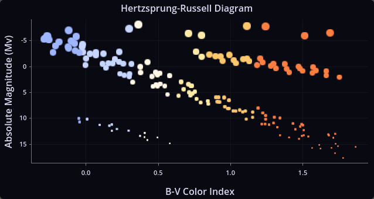
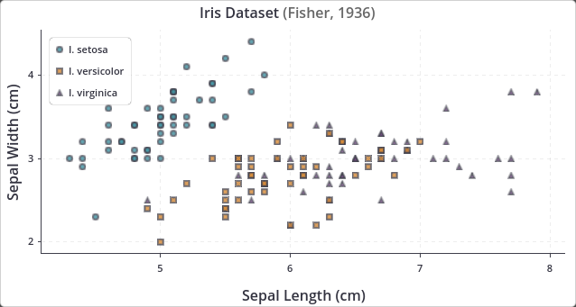
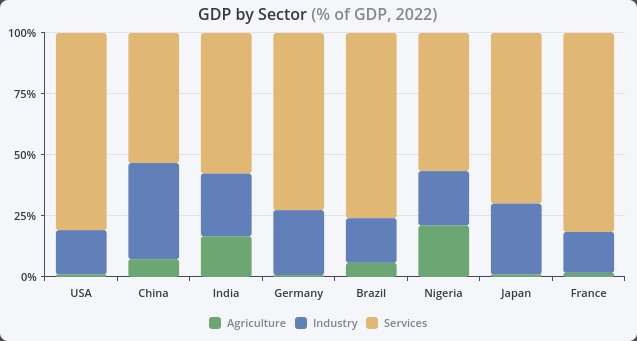
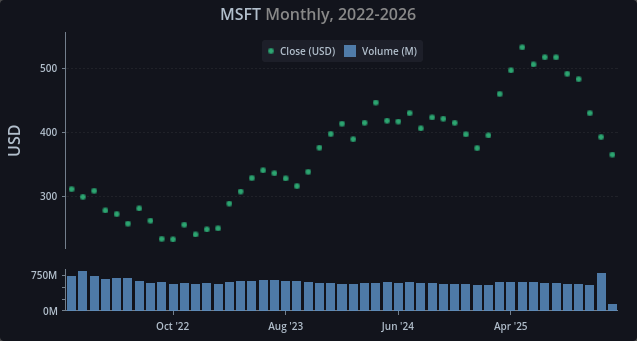
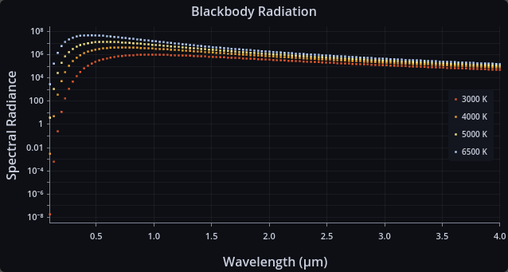
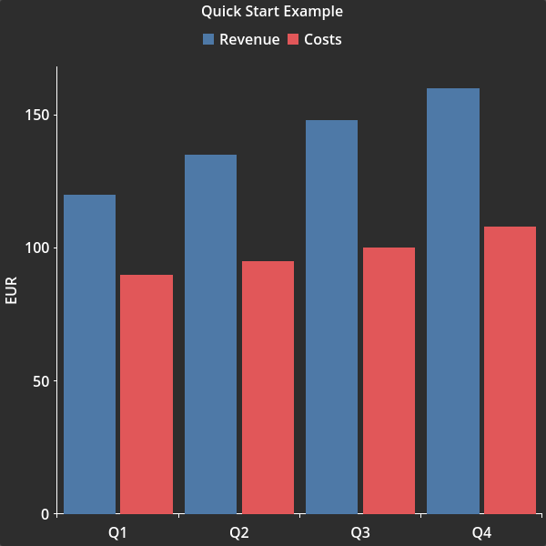

# TauPlot

**TauPlot** is a pure GDScript charting addon for Godot 4.5+ with no external dependencies. It draws interactive, performant and themeable plots inside any Godot UI.

## Key characteristics

- **Bar and scatter overlays** in any combination, with grouped, stacked, or independent bar modes.
- **Automatic tick and label generation with overlap prevention.** Ticks and labels adapt to the available space so they stay readable at any size, with no manual tuning required. The preferred tick count, overlap strategy, and minimum spacing are configurable, and the axis domain can be overridden with a fixed range when needed.
- **Real-time streaming** through ring-buffer datasets that drop the oldest samples automatically.
- **Multi-pane layouts** for displaying series with different Y scales (e.g. price above volume).
- **Per-sample styling** via attribute buffers or callbacks for color, alpha, marker shape, and more.
- **Full Godot theme integration** with a three-layer cascade (built-in defaults, theme, code overrides) across every visual property.
- **Hover inspection** with tooltip, crosshair, highlight, and interaction signals.


/// caption
**Example 1**: XY plot with per-sample visual overrides.
///


/// caption
**Example 2**: Scatter plot with legend inside (top-left).
///


/// caption
**Example 3**: Stacked bars with rounded corners with legend outside (bottom).
///


/// caption
**Example 4**: Multi-pane example with custom labels and legend inside (top).
///


/// caption
**Example 5**: Logarithmic scale with legend inside (right).
///

## Installation

TauPlot requires **Godot 4.5** or later.

### From the Godot Asset Library

1. Open the Godot editor and go to the **AssetLib** tab.
2. Search for **TauPlot**.
3. Click **Download**, then **Install** when prompted.
4. Open **Project > Project Settings > Plugins** and enable **TauPlot**.

### Manual installation

1. Download or clone the repository from [GitHub](https://github.com/ze2j/tau-plot).
2. Copy the `addons/tau-plot/` folder into your project's `addons/` directory.
3. Open **Project > Project Settings > Plugins** and enable **TauPlot**.

## Quick start

Create a scene where the root node is a `CenterContainer`. Add a `TauPlot` node child and name it `MyPlot`. Attach a script to the root node with the following content:

```gdscript
extends CenterContainer

func _ready() -> void:
	var dataset := TauPlot.Dataset.make_shared_x_categorical(
		PackedStringArray(["Revenue", "Costs"]),
		PackedStringArray(["Q1", "Q2", "Q3", "Q4"]),
		[
			PackedFloat64Array([120.0, 135.0, 148.0, 160.0]),
			PackedFloat64Array([90.0, 95.0, 100.0, 108.0]),
		]
	)

	var x_axis := TauAxisConfig.new()
	x_axis.type = TauAxisConfig.Type.CATEGORICAL

	var y_axis := TauAxisConfig.new()
	y_axis.title = "EUR"

	var bar_overlay_config := TauBarConfig.new()

	var pane := TauPaneConfig.new()
	pane.y_left_axis = y_axis
	pane.overlays = [bar_overlay_config]

	var config := TauXYConfig.new()
	config.x_axis = x_axis
	config.panes = [pane]

	var b0 := TauXYSeriesBinding.new()
	b0.series_id = dataset.get_series_id_by_index(0)
	b0.pane_index = 0
	b0.overlay_type = TauXYSeriesBinding.PaneOverlayType.BAR
	b0.y_axis_id = TauPlot.AxisId.LEFT

	var b1 := TauXYSeriesBinding.new()
	b1.series_id = dataset.get_series_id_by_index(1)
	b1.pane_index = 0
	b1.overlay_type = TauXYSeriesBinding.PaneOverlayType.BAR
	b1.y_axis_id = TauPlot.AxisId.LEFT

	var bindings: Array[TauXYSeriesBinding] = [b0, b1]

	$MyPlot.title = "Quick Start Example"
	$MyPlot.plot_xy(dataset, config, bindings)
```

Run the scene and you get:


/// caption
**Quick start**: Bar chart with 2 series, a legend and axis title with default style.
///

This example is available in `addons/tau-plot/examples/quick_start.tscn`.

## Documentation

- [Getting Started](getting-started.md) walks through building your first plot step by step.
- [API Reference](api/index.md) covers every class, property, enum, and signal.
- The [**demo**](addons/tau-plot/examples/demo.tscn) is an advanced example with nine plots showcasing theme customization and per-sample styling through attribute buffers and callbacks.
- [Tests](https://github.com/ze2j/tau-plot/tree/main/addons/tau-plot/tests) can provide good examples of how to use some features.

## Stability

The API may change between releases until version 1.0 is reached. Breaking changes will be documented in the changelog. Backward compatibility is taken seriously and disruption will be kept to a minimum, but at this stage correctness and design quality take priority over freezing the API.

If you encounter a bug, please open an issue on the [GitHub repository](https://github.com/ze2j/tau-plot/issues). Feedback from early adopters directly shapes the road to a stable 1.0.

## Contributing

Contributions are welcome. See [`CONTRIBUTING.md`](https://github.com/ze2j/tau-plot/blob/main/CONTRIBUTING.md) for details.

## Roadmap

The following features are planned for upcoming releases:

- **Line and area overlays** for XY plots.
- **Interactive legend** with click-to-toggle series visibility.
- **Pie and radar** plot types.

## License

TauPlot is released under the **BSD 3-Clause License**. See the full [license text](https://github.com/ze2j/tau-plot/blob/main/LICENSE) for details.